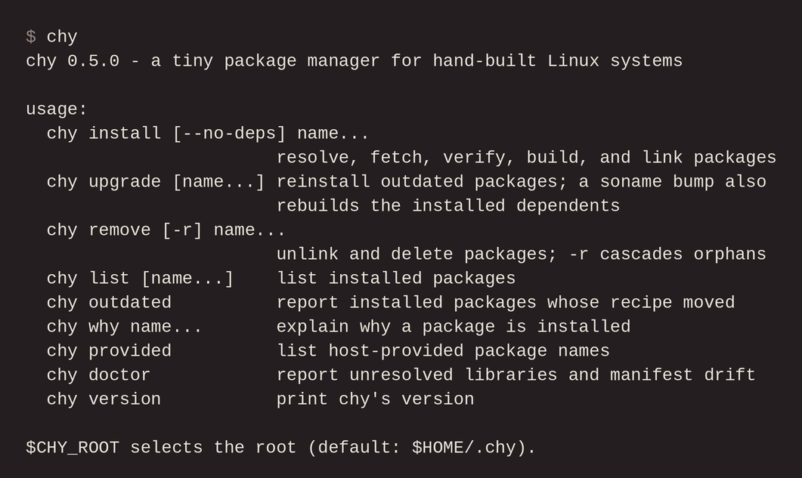

chy is a byte-sized, portable, source-based package manager written in
POSIX shell. 1.6k lines of pretty shell with no dependencies.

Everything lives under $CHY_ROOT, ~/.chy by default. Packages get built
into store/ and get linked into a usr/ symlink farm. chy lives in
userland and won't write outside its root, so deleting the folder is
equal to a full uninstall. Running chy with no arguments prints the list
of all options.

    git clone https://github.com/alperien/chy && cd chy
    git clone https://github.com/alperien/chy-recipes
    export CHY_ROOT=$HOME/.chy PATH="$HOME/.chy/usr/bin:$PATH"
    mkdir -p "$CHY_ROOT" && ln -s "$PWD/chy-recipes/recipes" "$CHY_ROOT/recipes"
    cp chy-recipes/shlibs.map "$CHY_ROOT/shlibs.map"
    sh chy/chy install freetype

Packages are recipe based and easily readable and tweakable. A recipe is
a folder containing text files: version, sources, checksums, depends,
makedepends, a build script, patches/, and an optional patchlevel for
patches that don't apply at -p1. For quick tweaks there's also
$CHY_ROOT/overlay/<name>, which chy reads before the repo.

The default repo, chy-recipes, is converted from Void Linux's xbps by
the chytrans tool. Void's maintainers do the packaging; a nightly sync
snapshots their templates, translates the set, and pushes what builds.
Fixes go into the translator; recipe PRs against chy-recipes get closed.

There is a one-page overview in docs/index.html.

All contributions are welcome.

MIT
